# ⚡ Iberdrola Android - Prácticas 2026 (MarPG)

Este repositorio contiene la solución técnica avanzada desarrollada para el programa de formación de **Iberdrola / Viewnext**. El proyecto no solo cumple con los hitos de las cuatro entregas oficiales, sino que integra módulos de valor añadido para elevar la experiencia de usuario y la robustez del sistema bajo estándares de industria.

---

## 🏗️ Arquitectura y Stack Tecnológico

La aplicación se rige por los principios de **Clean Architecture** y **MVVM**, garantizando un desacoplamiento total entre la lógica de negocio y la interfaz de usuario.

### 🧬 Capas del Sistema
* **Domain:** Lógica de negocio pura (**Use Cases**) sin dependencias de frameworks externos.
* **Data:** Gestión de datos con **Retrofit** para API y **Room** como caché persistente.
* **Ui:** Interfaces reactivas construidas íntegramente en **Jetpack Compose**.

### 🛠️ Especificaciones Técnicas
* **Single Source of Truth (SSOT):** Room actúa como única fuente de verdad. La UI observa la DB, y la red actualiza la DB, garantizando consistencia de datos.
* **Gestión de Estados:** Implementación de `StateFlow` y `SharedFlow` para una comunicación reactiva y fluida.
* **Inyección de Dependencias:** **Hilt** (Dagger) para la gestión del ciclo de vida de los componentes.
* **Persistencia Híbrida:**
    * **Room:** Para datos complejos y relacionales (Facturas, Contratos).
    * **DataStore (Preferences):** Gestión de estados atómicos como el conteo de diálogos de feedback y el usuario(se deja preparado los daos y la base de datos por si se relacionan los usuarios con los contratos y facturas).

---

## 📱 Flujo de Navegación y Pantallas

Se ha diseñado un grafo de navegación optimizado que incluye pantallas adicionales para una gestión completa y profesional:

### Esquema de Navegación (Flow)
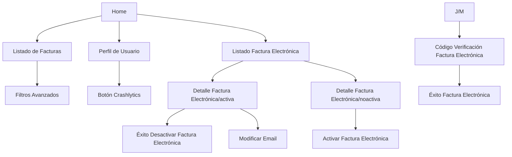
### Detalle de Pantallas

#### Home (Personalizada):
Es el centro de control principal. Ofrece accesos directos y una vista general para mejorar la usabilidad.
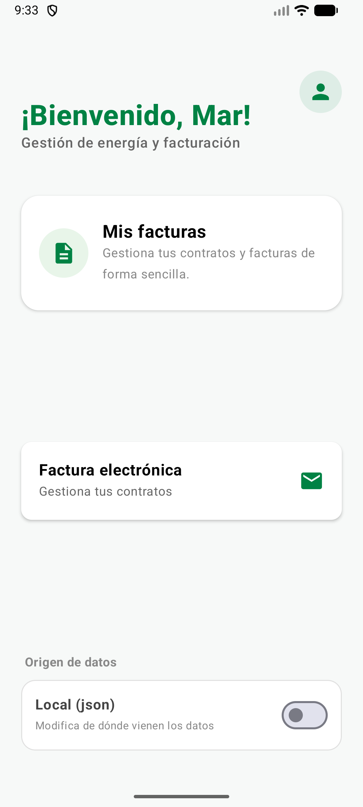

#### Perfil de Usuario (Personalizada):
Sección para que el usuario gestione su número de teléfono y email, datos clave para la facturación electrónica.
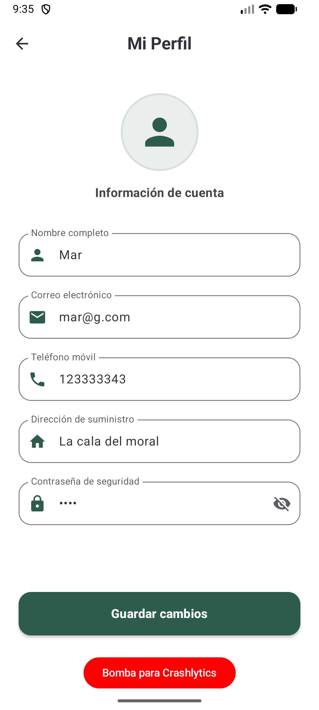

#### Feed de Facturas:
Lista principal de todas las facturas. Incluye efectos de carga (Shimmer) y responde a los filtros y la conexión de red.
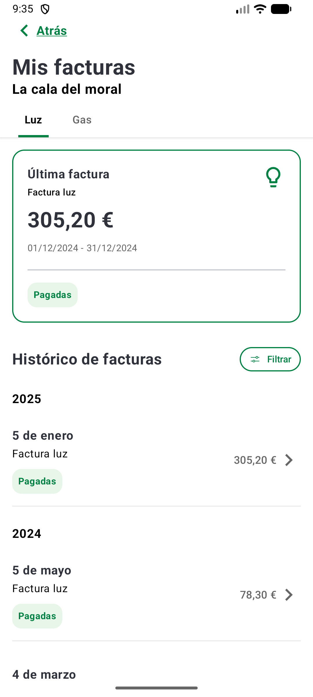

#### Filtrado de Facturas:
Pantalla con filtros avanzados para buscar facturas específicas (por fecha, importe, estado, etc.).
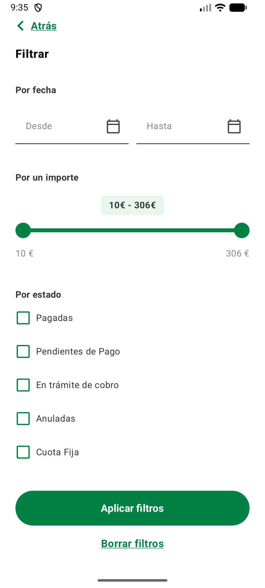

#### Feed de Facturas Electrónicas:
Muestra el estado de la facturación electrónica para los distintos contratos, indicando cuáles están activados.
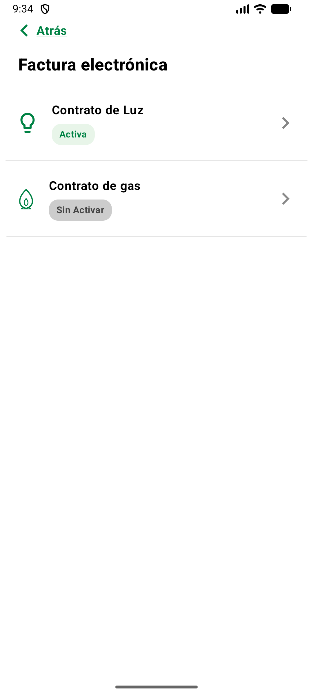

#### Detalle Factura Electrónica Activa:
Muestra los datos y opciones de configuración de una factura electrónica que ya está activada.
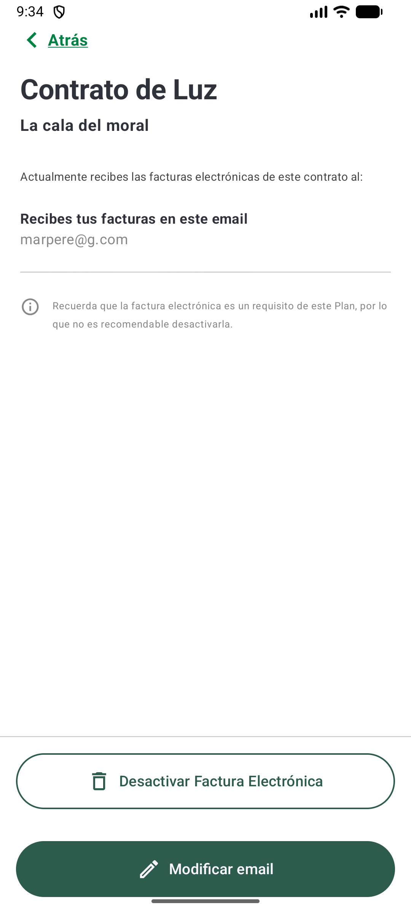

#### Éxito Desactivar Factura Electrónica (Personalizada):
Mensaje de confirmación que aparece tras desactivar correctamente el servicio de factura electrónica.
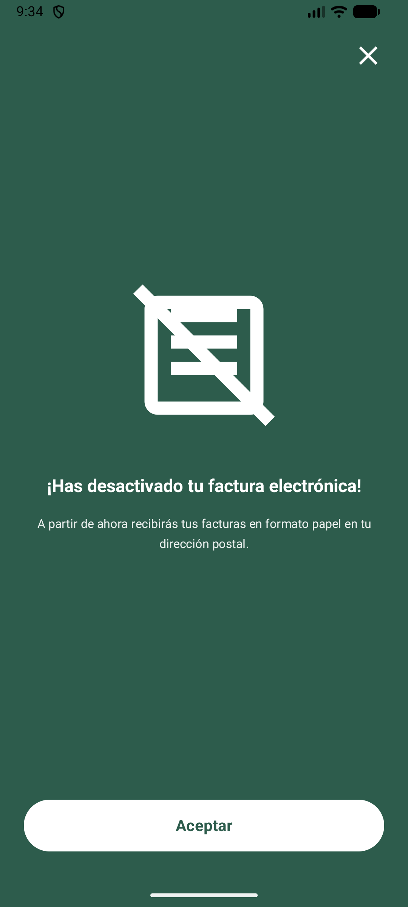

#### Edición Email de Factura Electrónica Activa:
Formulario sencillo para cambiar la dirección de correo electrónico donde se reciben las facturas electrónicas.
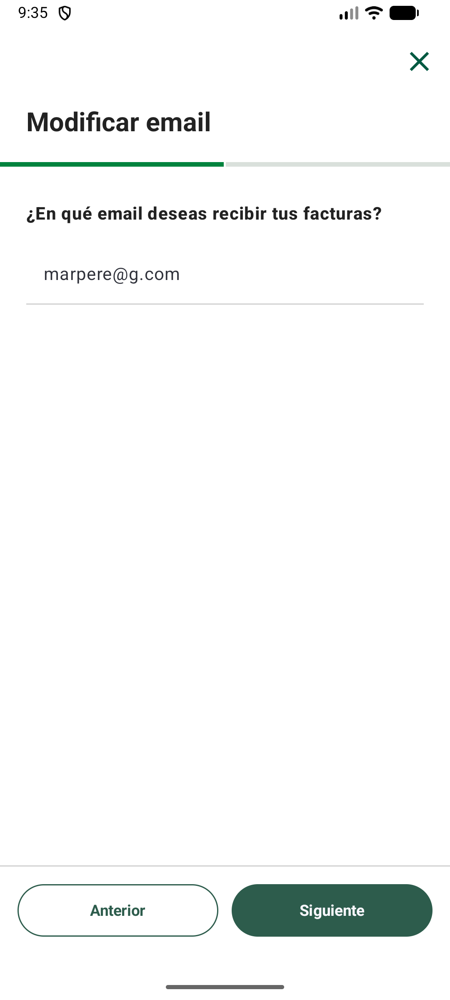

#### Activación de Factura Electrónica:
Proceso inicial para dar de alta el servicio de factura electrónica en un contrato.
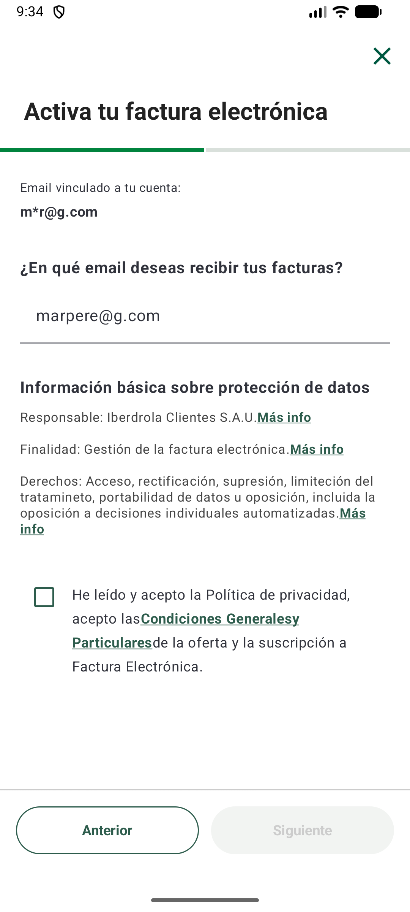

#### Código Verificación de Factura Electrónica:
Pantalla de seguridad para introducir el código recibido (SMS/Email) y confirmar la activación del servicio.
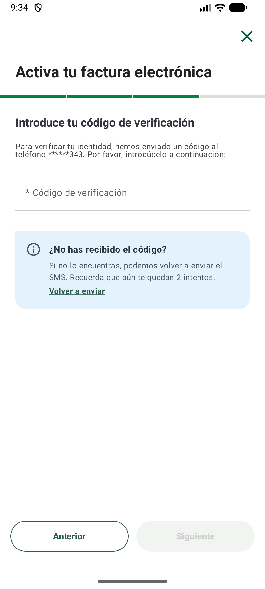

#### Éxito de Factura Electrónica:
Mensaje final que confirma que el proceso de activación o modificación se ha completado con éxito.
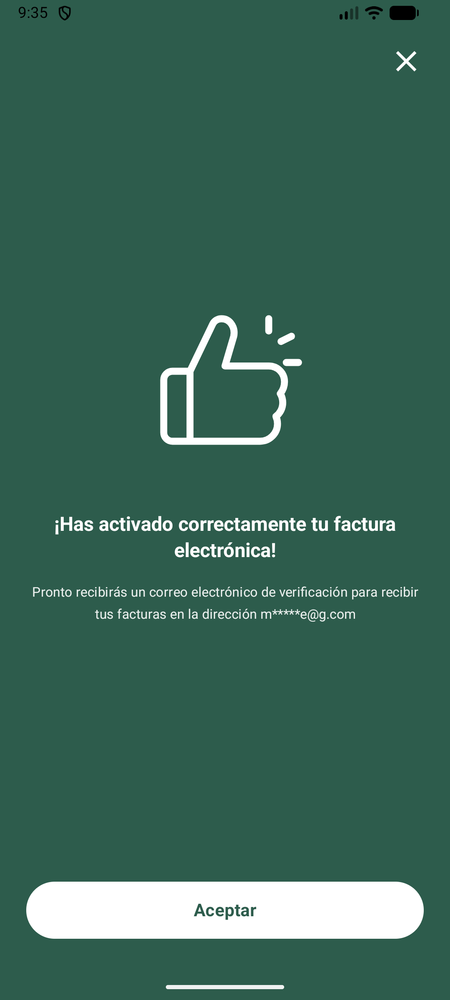

---

## 🌟 Funcionalidades de Valor Añadido
#### Switch de Conectividad: 
Selector de modo para forzar el Modo Offline, permitiendo validar la robustez de la caché local en entornos sin cobertura.

#### Feedback Inteligente: 
Uso de DataStore para persistir el número de visualizaciones del diálogo de feedback, asegurando que el conteo no se pierda al cerrar la App.

#### Gestión de Sesión de Usuario (DataStore):
Implementación de un perfil de usuario persistente mediante **Protocol Buffers (Proto DataStore)**. Esta solución permite que la lógica de las pantallas (como la Home y el Perfil) reaccione instantáneamente al estado del usuario, eliminando tiempos de carga innecesarios y garantizando que la información de contacto (email/teléfono) esté disponible de forma reactiva en todo el grafo de navegación.

---

## 🚀 Instalación y Configuración
Sigue estos pasos para desplegar el proyecto en tu entorno local:

#### Clonar el repositorio:

Bash
git clone [https://github.com/mpgea2004/IB2026MarPG.git](https://github.com/mpgea2004/IB2026MarPG.git)
#### Configurar Google Services:
Añadir el archivo google-services.json en la carpeta app/.

#### Sincronización:
Abrir con Android Studio Ladybug o superior y sincronizar Gradle.

#### Ejecutar:
Seleccionar un dispositivo físico o emulador con API 29 o superior.

---

## 🧪 Estrategia de Testing
Se ha blindado la aplicación con una cobertura de pruebas en dos niveles:

#### Unit Tests (test):
Validación de lógica de negocio en Use Cases, validadores de formulario y Mappers de datos.

#### Android Tests (androidTest): 
Pruebas de integración para validar operaciones CRUD y transacciones de caché en la base de datos Room.

---

## 📊 Monitorización (Cuarta Entrega)
#### Google Analytics: 
Tracking de navegación por pantallas y registro de eventos de interacción.

#### Crashlytics: 
Reporte de errores en tiempo real. Se incluye un botón de fallo forzado en la pantalla de Perfil.

#### Remote Config: 
Configuración dinámica de negocio para el filtrado de contratos de Gas sin necesidad de nueva publicación.

---

## ✒️ Desarrollado por MarPG > Prácticas de Especialización Android 2026 - Viewnext