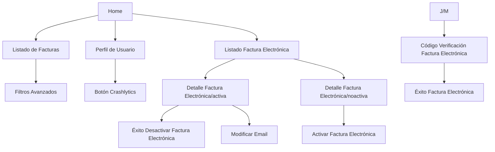

# ⚡ Iberdrola Android - Prácticas 2026 (MarPG)

[](https://kotlinlang.org/)
[](https://developer.android.com/jetpack/compose)
[](https://dagger.dev/hilt/)
[](https://developer.android.com)

<p align="center">
  
</p>

Este repositorio contiene la solución técnica avanzada desarrollada para el programa de formación de **Iberdrola / Viewnext**. El proyecto no solo cumple con los hitos de las entregas oficiales, sino que integra módulos de valor añadido bajo estándares de industria.

---

## 🏗️ Arquitectura y Stack Tecnológico

La aplicación se rige por los principios de **Clean Architecture** y **MVVM**, garantizando un desacoplamiento total entre la lógica de negocio y la interfaz de usuario.

### 🧬 Capas del Sistema
*   **`domain`**: Lógica de negocio pura (**Use Cases**) sin dependencias de frameworks.
*   **`data`**: Gestión de datos con **Retrofit** para API y **Room** como caché persistente (**SSOT**).
*   **`ui`**: Interfaces reactivas construidas íntegramente en **Jetpack Compose**.

### 🛠️ Especificaciones Técnicas
*   **Single Source of Truth (SSOT):** Room actúa como única fuente de verdad. La UI observa la DB, y la red actualiza la DB.
*   **Gestión de Estados:** Implementación de `StateFlow` y `SharedFlow` para una comunicación reactiva.
*   **Inyección de Dependencias:** **Hilt** (Dagger) para la gestión del ciclo de vida de los componentes.
*   **Persistencia Híbrida:**
    *   **Room:** Para datos complejos y relacionales (Facturas, Contratos).
    *   **DataStore (Preferences):** Gestión de estados atómicos (conteo de feedback, sesión de usuario).

---

## 📂 Estructura del Proyecto

```text
app/src/main/java/com/iberdrola/.../MarPG/
├── data/           # Implementaciones de Repositorios, API y DB
│   ├── local/      # Room (Entities, DAOs, Database)
│   ├── network/    # Retrofit (Services, Exceptions)
│   └── mapper/     # Conversión DTO <-> Entity <-> Domain
├── di/             # Módulos de Hilt (AppModule, NetworkModule)
├── domain/         # Casos de Uso y Modelos de Negocio
├── ui/             # UI Components, Screens y ViewModels
└── MainApplication.kt
```

---

## 📱 Flujo de Navegación y Pantallas

Se ha diseñado un grafo de navegación optimizado que incluye pantallas adicionales para una gestión completa:

### Esquema de Navegación (Flow)


### Detalle de Pantallas

#### Home (Personalizada)
Es el centro de control principal. Ofrece accesos directos y una vista general para mejorar la usabilidad.


#### Perfil de Usuario (Personalizada)
Sección para que el usuario gestione su número de teléfono y email, datos clave para la facturación electrónica.


#### Feed de Facturas
Lista principal de todas las facturas. Incluye efectos de carga (Shimmer) y responde a los filtros y la conexión de red.


#### Filtrado de Facturas
Pantalla con filtros avanzados para buscar facturas específicas.


#### Feed de Facturas Electrónicas
Muestra el estado de la facturación electrónica para los distintos contratos.


#### Detalle Factura Electrónica Activa
Muestra los datos y opciones de configuración de una factura electrónica activada.


#### Éxito Desactivar Factura Electrónica (Personalizada)
Mensaje de confirmación que aparece tras desactivar correctamente el servicio.


#### Edición Email de Factura Electrónica Activa
Formulario sencillo para cambiar la dirección de correo electrónico.


#### Activación de Factura Electrónica
Proceso inicial para dar de alta el servicio en un contrato.


#### Código Verificación de Factura Electrónica
Pantalla de seguridad para introducir el código recibido (SMS/Email).


#### Éxito de Factura Electrónica
Mensaje final que confirma que el proceso se ha completado con éxito.


---

## 🌟 Funcionalidades de Valor Añadido
#### Gestión de Facturación Electrónica
Implementación de un flujo completo de activación, modificación y **desactivación**. Incluye lógica de validación mediante código de verificación.

#### Switch de Conectividad
Selector de modo para forzar el Modo Offline, permitiendo validar la robustez de la caché local.

#### Feedback Inteligente
Uso de DataStore para persistir el número de visualizaciones del diálogo de feedback.

#### Gestión de Sesión de Usuario (DataStore)
Uso de **Preferences DataStore** para gestionar un perfil de usuario reactivo. Las pantallas reaccionan instantáneamente a cambios en el email o teléfono.

---

## 🚀 Instalación y Configuración

1.  **Clonar repositorio:**
    ```bash
    git clone https://github.com/mpgea2004/IB2026MarPG.git
    ```
2.  **Configurar Firebase:** Añadir el archivo `google-services.json` en la carpeta `app/`.
3.  **Sincronizar:** Abrir con Android Studio Ladybug o superior y sincronizar Gradle.
4.  **Ejecutar:** `./gradlew assembleDebug`

---

## 🧪 Estrategia de Testing

*   **Unit Tests (test):** Validación de lógica en Use Cases (ej. `FormatUserPhoneUseCaseTest`), validadores y Mappers.
*   **Android Tests (androidTest):** Pruebas de integración para validar operaciones CRUD en Room (ej. `UserDaoTest`).

---

## 📊 Monitorización (Cuarta Entrega)
*   **Google Analytics:** Tracking de navegación y registro de eventos (`filter_applied`, etc.).
*   **Crashlytics:** Reporte de errores. Se incluye un botón de fallo forzado en la pantalla de Perfil.
*   **Remote Config:** Configuración dinámica para el filtrado de contratos de Gas.

---

## ✒️ Desarrollado por
**MarPG** - Prácticas de Especialización Android 2026  (Viewnext)
